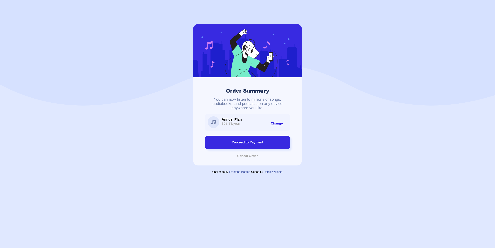

# Frontend Mentor - Order summary card solution

This is a solution to the [Order summary card challenge on Frontend Mentor](https://www.frontendmentor.io/challenges/order-summary-component-QlPmajDUj). Frontend Mentor challenges help you improve your coding skills by building realistic projects.

## Table of contents

- [Overview](#overview)
  - [The challenge](#the-challenge)
  - [Screenshot](#screenshot)
  - [Links](#links)
- [My process](#my-process)
  - [Built with](#built-with)
  - [What I learned](#what-i-learned)
  - [Continued development](#continued-development)
  - [Useful resources](#useful-resources)
- [Author](#author)

## Overview

### The challenge

Users should be able to:

- See hover states for interactive elements

### Screenshot



### Links

- Solution URL: [https://omerome83.github.io/Order-Summary-Component](https://omerome83.github.io/Order-Summary-Component)

## My process

- Congifure GitHub on my machine
- Inspect all of the images and original source files
- Mentally design the layout in my head and see how each section can be divided
- Create each section in different background colors to visually see how lay things out
- Use Google and other sources when stuck
- Tweak the HTML/CSS and lineup the elements
- Validate each requirement
- Deploy to GitHub

### Built with

- Semantic HTML5 markup
- CSS properties
- Mobile-first workflow

### What I learned

Honestly, when I first took a look at the challenge, I was very intimidated! I was fresh off an HTML5 and CSS video tutorial and I thought my skills were a bit lacking, but I wanted to give it a shot anyway. Web development is definitely not easy, but it was very much rewarding when things started to fall into place.

So as I got started, what stumped me first was figuring out how to round out just the top corners of the page and this is what I came up with:

```css
.music-image-container {
  border-top-left-radius: 1.25rem;
  border-top-right-radius: 1.25rem;
}
```

What I really need to get better at is to break up any project into smaller parts instead of trying to take on everything at once. Do one step at a time and then move on to the next and make changes if needed. I also learned that instead of getting frustrated when you're at a feature, take a break. If it means walk away, hydrate and/or get something to eat, play video games, do it. It's important to stay clear headed and try to create a working environment that promotes productivity. Listen to calming music if it helps and also make sure a good desk chair/stand desk!

### Continued development

My next step is to continue to improve on my CSS skills and then learn more JavaScript. I have had experience with HTML/CSS/JavaScript years ago, but as we know, technology changes quickly! Once I gain experience and confidence, I look forward to tackling on React/Angular and then learn some back-end development languages like Node.JS and Python. But as I mentioned early, it's important to take small steps at a time and learn a little to not become overwhelmed.

### Useful resources

- [MDN Web Docs](https://developer.mozilla.org/en-US/) - One of the best resources for anything web development, if not the best as they are extremely well documented..
- [Dr. Angela Yu](https://www.udemy.com/course/the-complete-web-development-bootcamp/) - Dr. Yu is an amazing instructor who step-by-step taught each lesson in a way that was easy to understand and still not feeling at all boring. -[W3Schools](https://www.w3schools.com/) - Another very good resource for web development and even has an online HTML testing tool to try things out.

## Author

- Website - [Romel Williams](https://github.com/omerome83)
- Frontend Mentor - [@omerome83](https://www.frontendmentor.io/profile/omerome83
